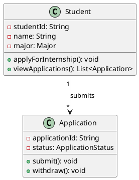
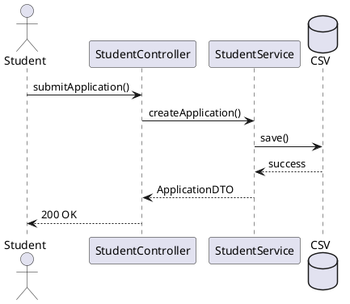

# 📐 UML Diagrams Documentation

## 📖 Overview

This directory contains comprehensive UML (Unified Modeling Language) diagrams for the **Internship Placement Management System (SC2002)**. The diagrams provide visual documentation of both the static structure (class diagrams) and dynamic behavior (sequence diagrams) of the system.

## 📂 Folder Structure

```
uml/
├── README.md                          # This file
├── export-diagrams.ps1                # PowerShell script to export diagrams
├── class-diagrams/                    # Static structure diagrams
│   ├── 02-model-hierarchy.puml
│   ├── 03-backend-oop-class-diagram.puml
│   ├── 04-backend-simplified-abstract.puml
│   └── README.md                      # Class diagram documentation
├── sequence-diagrams/                 # Dynamic behavior diagrams
│   ├── 01-student-application-workflow.puml
│   ├── 02-company-rep-application-review.puml
│   ├── 02-company-rep-approve-application-simplified.puml
│   ├── 03-company-rep-registration-approval.puml
│   ├── 04-authentication-authorization.puml
│   └── README.md                      # Sequence diagram documentation
└── exported-images/                   # Generated diagram images (PNG/SVG)
    ├── *.png                          # Raster format exports
    └── *.svg                          # Vector format exports
```

## 🎯 What's Inside

### 📊 Class Diagrams (`class-diagrams/`)

Class diagrams show the **static structure** of the system, including:

- **Classes**: All model, service, controller, repository, and utility classes
- **Attributes**: Fields with their data types and visibility
- **Methods**: Operations with parameters and return types
- **Relationships**: Inheritance, associations, dependencies, compositions
- **Design Patterns**: Repository, Service Layer, MVC, DTO patterns
- **OOP Principles**: Abstraction, encapsulation, inheritance, polymorphism

**Key Diagrams:**
- `02-model-hierarchy.puml` - User hierarchy and model relationships
- `03-backend-oop-class-diagram.puml` - Complete backend OOP class structure
- `04-backend-simplified-abstract.puml` - Simplified abstract view of backend architecture

📖 For detailed information, see [`class-diagrams/README.md`](./class-diagrams/README.md)

### 🔄 Sequence Diagrams (`sequence-diagrams/`)

Sequence diagrams show the **dynamic behavior** and interactions between components:

- **Workflows**: Step-by-step process flows
- **Interactions**: Messages between objects
- **Timing**: Order of operations
- **Business Rules**: Validation and constraints
- **Error Handling**: Exception flows and recovery

**Key Diagrams:**
- `01-student-application-workflow.puml` - Student application submission process
- `02-company-rep-application-review.puml` - Company representative application review workflow
- `02-company-rep-approve-application-simplified.puml` - Simplified application approval process
- `03-company-rep-registration-approval.puml` - Company representative registration workflow
- `04-authentication-authorization.puml` - User authentication and role-based access

📖 For detailed information, see [`sequence-diagrams/README.md`](./sequence-diagrams/README.md)

## 🔧 Tools & Prerequisites

### Required Software

1. **Java Runtime Environment (JRE)**
   - Required to run PlantUML
   - Download: https://www.java.com/download/
   - Verify installation: `java -version`

2. **PlantUML JAR** (Auto-downloaded by script)
   - The export script will automatically download PlantUML if not present
   - Manual download: https://plantuml.com/download

### Optional Tools

- **VS Code with PlantUML Extension** (Recommended for editing)
  - Extension: `jebbs.plantuml`
  - Install: `Ctrl+Shift+X` → Search "PlantUML" → Install
  
- **Graphviz** (For better diagram rendering)
  - Windows: `choco install graphviz`
  - macOS: `brew install graphviz`
  - Linux: `apt-get install graphviz`

## 🚀 Exporting Diagrams

### Using the PowerShell Script

The `export-diagrams.ps1` script automates the process of converting PlantUML files (`.puml`) to image formats (PNG and SVG).

#### **Quick Start**

```powershell
# Navigate to the UML directory
cd "docs\uml"

# Run the export script
.\export-diagrams.ps1
```

#### **What the Script Does**

1. ✅ Checks for PlantUML JAR file (downloads if missing)
2. ✅ Creates `exported-images/` directory if it doesn't exist
3. ✅ Finds all `.puml` files in `class-diagrams/`
4. ✅ Exports each diagram to **PNG** (raster) format
5. ✅ Exports each diagram to **SVG** (vector) format
6. ✅ Opens the output directory when complete

#### **Script Output Example**

```
================================================
PlantUML Diagram Export Script
================================================

Found 8 PlantUML file(s) to export

Exporting: 02-model-hierarchy.puml
  ✓ PNG exported: exported-images\model-hierarchy.png
  ✓ SVG exported: exported-images\model-hierarchy.svg

Exporting: 03-backend-oop-class-diagram.puml
  ✓ PNG exported: exported-images\backend-oop-principles.png
  ✓ SVG exported: exported-images\backend-oop-principles.svg

Exporting: 04-backend-simplified-abstract.puml
  ✓ PNG exported: exported-images\backend-simplified-abstract.png
  ✓ SVG exported: exported-images\backend-simplified-abstract.svg

... (and 5 more sequence diagrams)

================================================
Export complete!
Exported images are in: D:\...\docs\uml\exported-images
================================================
```

### Exported Image Formats

#### PNG Format
- **Use case**: Documentation, presentations, web display
- **Pros**: Universal compatibility, easy to embed
- **Cons**: Fixed resolution, larger file size
- **Location**: `exported-images/*.png`

#### SVG Format
- **Use case**: High-quality documentation, scalable displays
- **Pros**: Vector format, infinite scaling, smaller file size
- **Cons**: May require SVG-compatible viewer
- **Location**: `exported-images/*.svg`

## 📝 Viewing and Editing Diagrams

### Method 1: VS Code (Recommended)

1. **Install PlantUML Extension**
   ```
   Ctrl+Shift+X → Search "PlantUML" → Install
   ```

2. **Open a `.puml` File**
   ```
   Double-click any .puml file in VS Code
   ```

3. **Preview Diagram**
   ```
   Press Alt+D or use Command Palette (Ctrl+Shift+P) → "PlantUML: Preview Current Diagram"
   ```

4. **Export from Preview**
   ```
   Right-click preview → "Export Current Diagram" → Select format
   ```

### Method 2: Online Viewer

1. Visit: https://www.plantuml.com/plantuml/uml/
2. Copy the contents of a `.puml` file
3. Paste into the text area
4. View and download the rendered diagram

### Method 3: Command Line

```powershell
# Export specific diagram to PNG
java -jar plantuml.jar class-diagrams/02-model-hierarchy.puml

# Export to SVG
java -jar plantuml.jar -tsvg class-diagrams/02-model-hierarchy.puml

# Export all diagrams in a folder
java -jar plantuml.jar class-diagrams/*.puml
java -jar plantuml.jar sequence-diagrams/*.puml
```

## 🛠️ Editing PlantUML Diagrams

### Basic PlantUML Syntax

#### Class Diagram Example


#### Sequence Diagram Example


### Modifying Diagrams

1. **Open the `.puml` file** in VS Code
2. **Edit the text** using PlantUML syntax
3. **Preview changes** with `Alt+D`
4. **Save the file** (`Ctrl+S`)
5. **Re-export** using the export script

## 📚 PlantUML Resources

### Official Documentation
- **PlantUML Homepage**: https://plantuml.com/
- **Class Diagram Guide**: https://plantuml.com/class-diagram
- **Sequence Diagram Guide**: https://plantuml.com/sequence-diagram
- **Component Diagram Guide**: https://plantuml.com/component-diagram

### Tutorials
- **PlantUML Quick Start**: https://plantuml.com/starting
- **Real World PlantUML**: https://real-world-plantuml.com/
- **UML Tutorial**: https://www.visual-paradigm.com/guide/uml-unified-modeling-language/

### Cheat Sheets
- **PlantUML Cheat Sheet**: https://ogom.github.io/draw_uml/plantuml/
- **UML Notation Guide**: https://www.uml-diagrams.org/

## 🎨 Diagram Conventions

### Visibility Symbols
- `+` Public
- `-` Private
- `#` Protected
- `~` Package

### Relationships
- `--|>` Inheritance (extends)
- `..|>` Implementation (implements)
- `-->` Association
- `--o` Aggregation
- `--*` Composition
- `..>` Dependency

### Multiplicity
- `1` Exactly one
- `0..1` Zero or one
- `*` Zero or more
- `1..*` One or more

## 🔄 Updating Diagrams

### When to Update

Update diagrams when:
- ✏️ New classes or methods are added
- ✏️ Existing classes are modified
- ✏️ Relationships between classes change
- ✏️ New workflows are implemented
- ✏️ Business rules are updated

### Update Process

1. **Modify the `.puml` file** with the changes
2. **Preview** to verify correctness
3. **Run export script** to generate new images
4. **Commit changes** to version control
   ```bash
   git add docs/uml/
   git commit -m "docs: update UML diagrams for [feature/change]"
   ```

## 🚨 Troubleshooting

### Issue: "Java not found"
**Solution**: Install Java Runtime Environment
```powershell
# Check Java installation
java -version

# Install Java (using Chocolatey)
choco install openjdk
```

### Issue: "PlantUML download failed"
**Solution**: Manually download PlantUML
1. Visit: https://plantuml.com/download
2. Download `plantuml.jar`
3. Place in `docs/` folder

### Issue: "Diagram doesn't render in VS Code"
**Solution**: Install Graphviz
```powershell
# Windows (Chocolatey)
